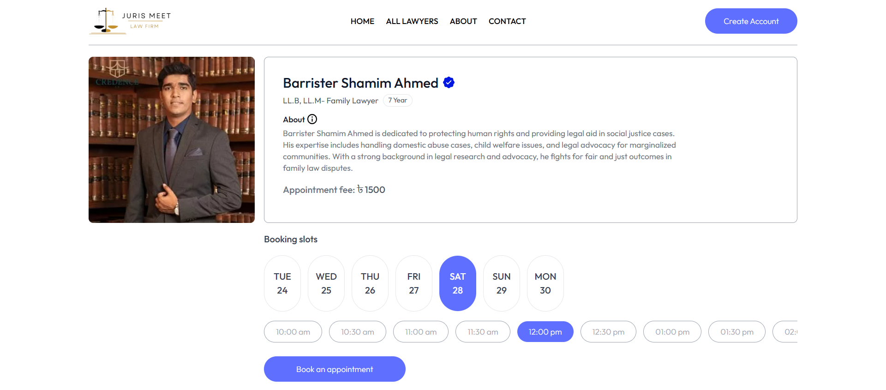
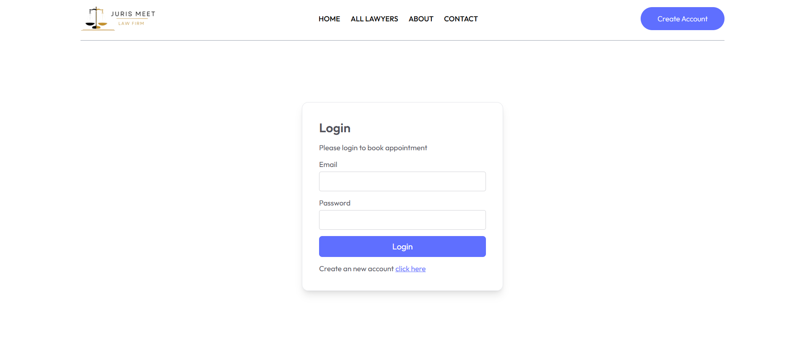

# ⚖️ Juris Meet

**Juris Meet** is a full-stack lawyer appointment booking web application that allows clients to schedule consultations, view available lawyers, and make secure payments online.

---

## 🌍 Live Demo

- **Frontend:** [https://juris-meet-frontend-1wod.onrender.com/](https://juris-meet-frontend-1wod.onrender.com/)
- **Admin:** [https://juris-meet-admin-v22k.onrender.com/](https://juris-meet-admin-v22k.onrender.com/)

login info:
 - ADMIN EMAIL: admin@jurismeet.com
 - ADMIN PASSWORD: raahaat54

---

## 🔍 Features

### 🌐 Client Side
- Browse available lawyers
- Book appointments with real-time slots
- Pay online (bKash)
- View and manage bookings

### 🛠️ Admin Panel
- View upcoming appointments
- Manage lawyer availability
- Secure login and access

### 🔒 Authentication
- User login/registration
- Protected routes for both users and admin

### 💳 Payment Integration
- bKash (via SSLCommerz)

---

## 🧑‍💻 Tech Stack

### Frontend
- Vite + React
- Tailwind CSS
- React Router
- Axios

### Backend
- Node.js
- Express.js
- MongoDB
- Mongoose
- JWT Authentication

---

## 🖼️ Screenshots

### 🏠 Home Page

### 📅 Booking Page

### 🔐 Login Page

### 🛠️ Admin Dashboard

## 🚀 Getting Started Locally

### Prerequisites

- Node.js
- MongoDB

